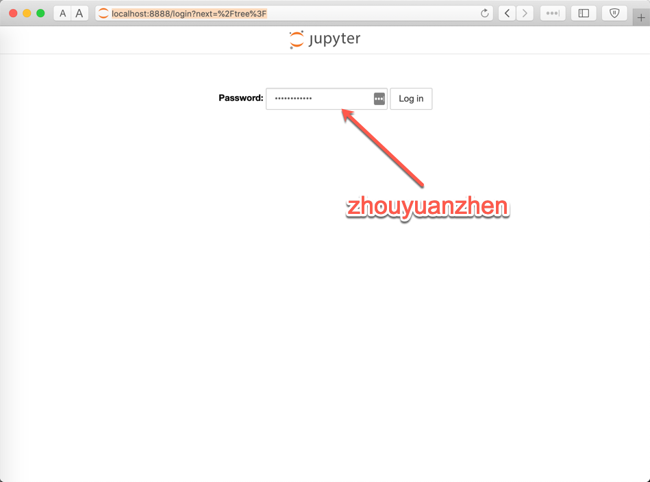
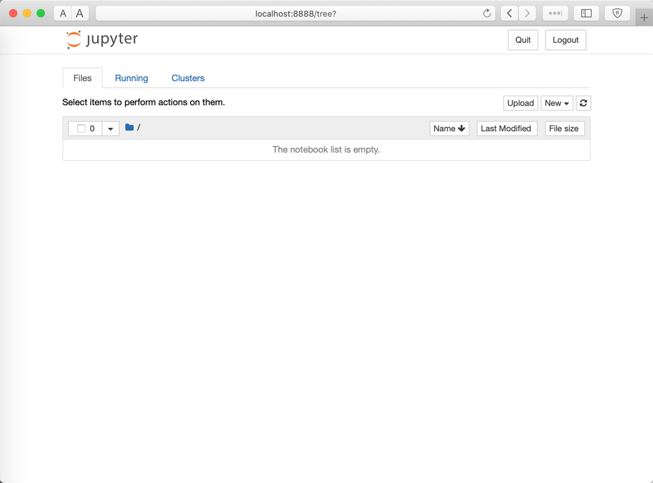
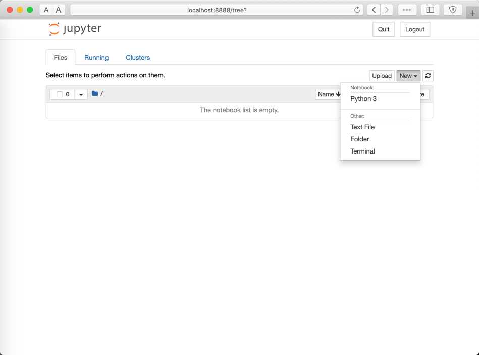
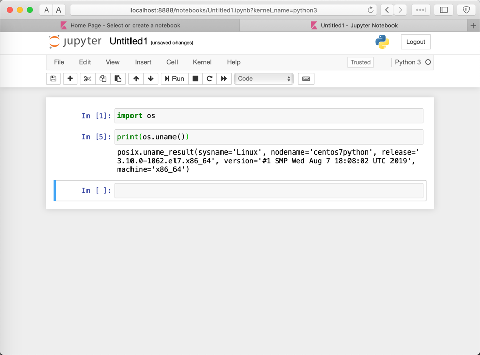

# README

This is a quick start vagrant box environment with Jupyter Notebook service running in background.

## QuickStart

```shell
# (Spawn up this vagrant python Jupter Notebook box)
$ vagrant up

$ vagrant ssh
(.venv) [vagrant@centos7python ~]$

...

```

## Use Jupyter Notebook

- Open [http://localhost:8888](http://localhost:8888) 

- Login with password: `zhouyuanzhen`.



- Enter workspace:



- Create a new Python 3 Notebook



- Play with your Python code!



Enjoy with it!
